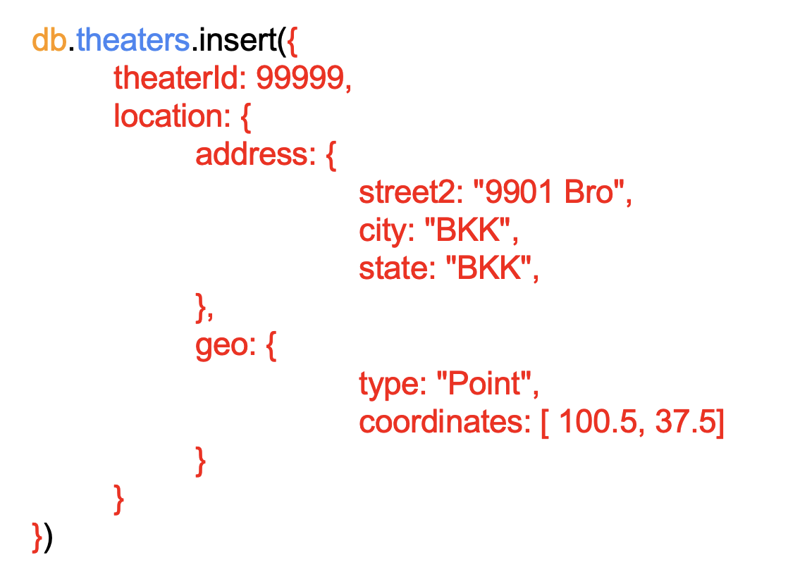

<h2>Module 2: Create Document - Example 1</h2>

<h4>Prerequisite</h4>
<li>MongoDB Compass</li>
<li>MongoDB Atlas</li>
<li>Connect Compass to MongoDB</li>
<li>sample_mflix (sample data)</li>

<h4>Database & Collection</h4>
<li>Database: sample_mflix</li>
<li>Collection: theaters</li>

<h4>Instruction</h4>

- Create a theater into `theaters` collection

 

